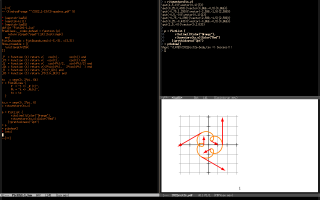

# Introduction

This is a Lua library that I am using to draw complex drawings in
LaTeX. It is a rewrite of some old modules that I wrote for [dednat6](http://angg.twu.net/dednat6/tug-slides.pdf);
these old modules could generate figures for Calculus (like [these
ones](http://angg.twu.net/2022eev-svg.html)) and for Heyting Algebras (like the ones [here](http://angg.twu.net/math-b.html#zhas-for-children-2)) using [pict2e](https://ctan.org/pkg/pict2e?lang=en) as
the back-end - my laptop is quite slow, so I prefer to use pict2e
instead of Tikz.

These old modules for Dednat6 were hard to use - I had to control by
hand the order of some nested blocks and indentation of the generated
code - so I decided to rewrite them using better classes. You can see
some nice methods of these new classes [here](http://angg.twu.net/LUA/Pict2e1.lua.html#Pict2e-methods) and [here](http://angg.twu.net/LUA/Pict2e1.lua.html#PictBounds-methods), but the nicest
thing of my Pict2e objects is that they can call methods from the [Show](http://angg.twu.net/LUA/Pict2e1.lua.html#Show)
class to save their LaTeX code to a file, compile the .tex file, and
report if the compilation went well - and if the compilation worked we
can make Emacs display the PDF by typing a single key. See the
screenshot below:

Future versions of this package will support [emlua](https://github.com/edrx/emlua/#introduction), and use it to make
Emacs display the new PDF as sson as it gets ready; and they will also
support generating both pict2e and [SVG](http://angg.twu.net/2022eev-svg.html). Recompiling the .tex file and
displaying the new PDF takes 6 seconds in my machine, but displaying a
new SVG should take less than 0.5 seconds&#x2026;

&#x2026;but *this* version is made to be very easy to test, and to have
very few dependencies. You only need Emacs 28 or more recent, with the
packages [eev](http://angg.twu.net/#eev) (from [ELPA](https://elpa.gnu.org/packages/eev.html)) and [lua-mode](http://elpa.nongnu.org/nongnu/lua-mode.html) and [pdf-tools](http://elpa.nongnu.org/nongnu/pdf-tools.html) (from [NonGNU
ELPA](https://elpa.nongnu.org/)); you also need LaTeX and Lua5.1 - you can install them in Debian
with:

    sudo apt-get install texlive-base lua5.1

